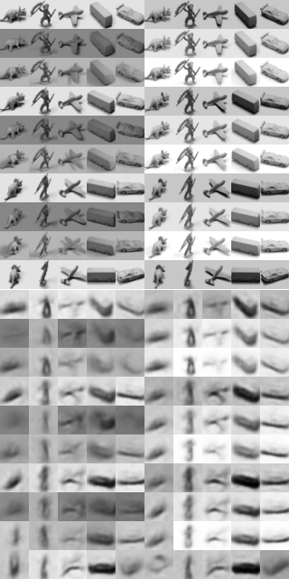
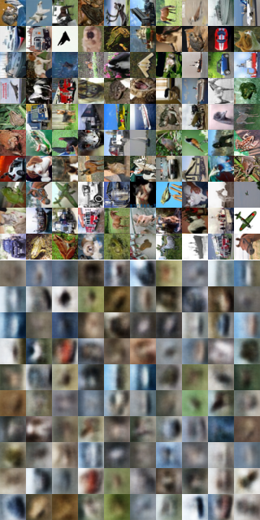
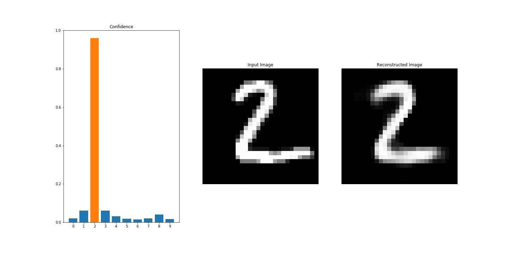
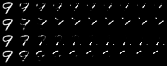

# CapsNet
Capsule networks is a novel approach showing promising results on SmallNorb and MNIST. Here we reproduce and build upon the impressive results shown by [Sara Sabour et al.](https://arxiv.org/abs/1710.09829) We experiment on the Capsule Network architecture by visualizing exactly what the capsules on different layers represents, what information they store about 3D objects in an image, and try to improve its classification results on CIFAR10 and SmallNorb with various methods including some tricks with reconstruction loss. Further, We present a deconvolution-based reconstruction module that reduces the number of learnable parameters by 80% from the fully-connected module presented by Sara Sabour et al. 

## Benchmarks

Our baseline model is the same as the original paper, but is only trained for 113 epochs on MNIST, and we did not use a 7-model ensemble for CIFAR10 as did in the paper.

|Model         |  MNIST  |  SmallNORB  |  CIFAR10  |
|:-------------|:-------:|:-----------:|:---------:|
|Sabour et al. | 99.75%  | 97.3%       | 89.40%    |
|Baseline      | 99.73%  | 91.5%       | 72.59%    |

## Experiments

We introduced a deconvolution-based reconstructions module, and experimented with Batch normalization and different network topologies.

### Deconvolution-based Reconstruction

The baseline model has 1.4M parameters in the fully connected decoder, while our deconvolution-based reconstruction module recudes the number of learnable parameters by 80% down to 0.25M.


Here is an comparison between the two reconstruction modules after training for 25 epochs on MNIST, where RLoss is the SSE reconstruction loss, and MLoss is the margin loss.

|Model        |  RLoss  |  MLoss  |  Accuracy  |
|:------------|:-------:|:-------:|:----------:|
|FC           | 21.62   | 0.0058  | 99.51%     |
|FC w/ BN     | 13.12   | 0.0054  | 99.54%     |
|DeConv       | 10.87   | 0.0050  | 99.54%     |
|DeConv w/ BN | 9.52    | 0.0044  | 99.55%     | 

## Visualization

### Reconstructions

Here are the reconstruction results for SmallNORB and CIFAR10, after training for 186 epochs and 86 epochs respectively.




### Robustness to Affine Transformations

We visualized how the network recognizes a rotated MNIST image when only trained on unmodified MNIST data. We present an image of number 2 as an example. The network is confident about the result when the image is just slightly rotated, but as the image is further rotated, it starts to confuse the image with other numbers. For example, it is very confident about the image being number 7 at a certain angle, and reconstructs a number 7 that aligns pretty well with the input. Due to its special topological features, the input number 2 is still recognized by the network when rotated by 180&deg;.



### Primary Capsules Reconstructions

We used a pre-trained network to train a reconstruction module for Primary Capsules. By scaling these capsules by its routing coefficients to the classified object, we were able to visualize reconstructions from Primary Capsules. Each row is reconstructed from a single capsule, and the routing coefficient is increased from left to right.



## Usage

**Step 1. Install requirements**

* Python 3
* PyTorch
* Torchvision 0.2.1
* TQDM

**Step 2. Adjust hyperparameters**

In ```constants.py```:
```python
DEFAULT_LEARNING_RATE = 0.001
DEFAULT_ALPHA = 0.0005 # Scaling factor for reconstruction loss
DEFAULT_DATASET = "small_norb" # 'mnist', 'small_norb'
DEFAULT_DECODER = "FC" # 'FC' or 'Conv'
DEFAULT_BATCH_SIZE = 128
DEFAULT_EPOCHS = 300
DEFAULT_USE_GPU = True
DEFAULT_ROUTING_ITERATIONS = 3
```

**Step 3. Start training**

Training with default settings:

```console
$ python train.py
```

Training flags example:

```console
$ python train.py --decoder=Conv  --file=model32.pt --dataset=mnist
```

Further help with training flags:

```console
$ python train.py -h
```

**Step 4. Get your results**

Trained models are saved in ```saved_models``` directory. Reconstruction results are saved in ```reconstructions```. You can also use the Jupyter Notebooks in ```notebooks``` for some futher experiments.

## Future work

* Fully develop notebooks for visualization and plotting.
* Implement [EM routing](https://openreview.net/pdf?id=HJWLfGWRb).


